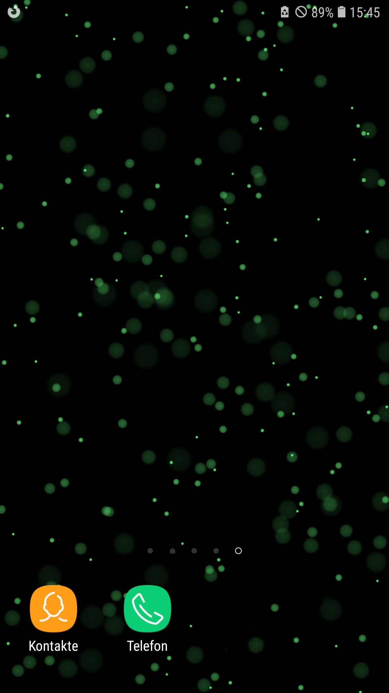

# Brownian Particles Android Live Wallpaper

This is an Android Live Wallpaper that simulates the appearance of the Brownian motion of particles under a microscope illuminated by colored laser light.

Such observations are a classical physics experiment, but also used eg. in microrheology to measure the viscosity of mucus.

When I saw this experiment in University, I thought that it looked so cool that I had to make a live wallpaper out of it for my phone, where I have used it for the majority of the past decade.
After getting a new phone, having to refresh the app anyways, and showing the wallpaper to some friends who wanted to also have it, I finally set out to bring it to F-Droid.

The live wallpaper is highly optimized, running on the GPU, to keep the battery drainage as minimal as possible.

To set it up, you might need to use a Wallpaper app (eg. the Google one) since some launchers don't allow installing live wallpapers.

## Dependencies

This App uses the library [GLWallpaperService](https://github.com/GLWallpaperService/GLWallpaperService) (Apache 2.0).  
Because the lib is old, apparently not available in public repos, and doesn't use gradle, it is simply included as a git submodule and it's source folder is included in the gradle build process.  
This means that to build this app, you need to have run `git submodule init && git submodule update`.